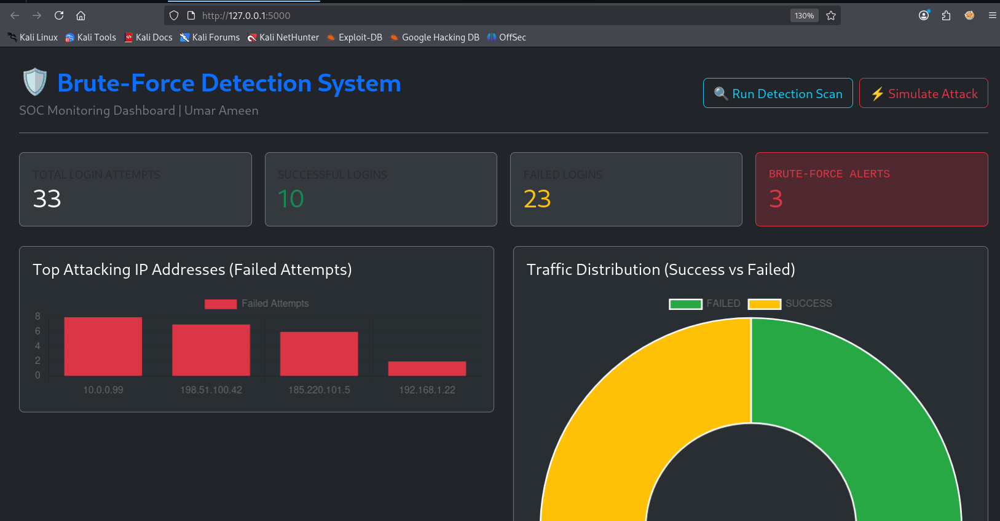
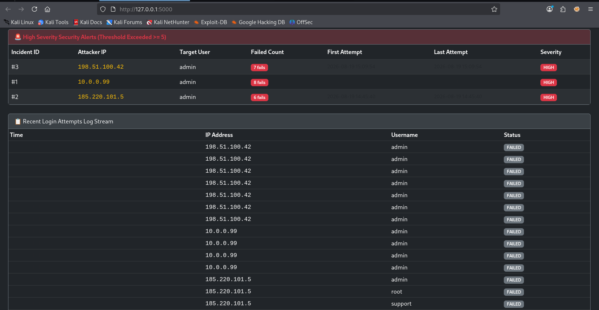

# Brute-Force Detection & SOC Monitoring Dashboard
**Capstone Project #7 | CyArt Cyber Security Internship**  
**Author:** Umar Ameen

---

## 1. Project Overview
An internal SOC monitoring dashboard designed to detect repeated authentication failures and visualize brute-force and password spraying attacks using synthetic security event logs in an isolated lab environment.

---

## 2. Architecture & Data Flow
* **Simulator (`simulator.py`):** Generates realistic normal logins, targeted brute-force, and password spraying traffic.
* **Database (`database.py`):** SQLite schema tracking attempts (`login_attempts`) and incidents (`security_alerts`).
* **Detection Engine (`detector.py`):** Rule-based correlation scanning 10-minute sliding windows for >= 5 failed attempts.
* **Web Dashboard (`app.py` + Chart.js):** Real-time monitoring metrics, interactive attack simulation, and incident visualizer.

---

## 3. Security Features
* **Threshold Detection:** Flags any IP with >= 5 failed attempts within 10 minutes.
* **Attack Pattern Differentiation:** Distinguishes between single-user targeted attacks and multi-account password spraying.
* **Alert Deduplication:** State-aware incident logging preventing redundant alerts.

---

## 4. How to Run
```bash
python3 database.py
python3 simulator.py
python3 app.py


---

## 5. Test Results & Visual Evidence

### SOC Monitoring Dashboard Overview


### High-Severity Brute-Force Alerts

